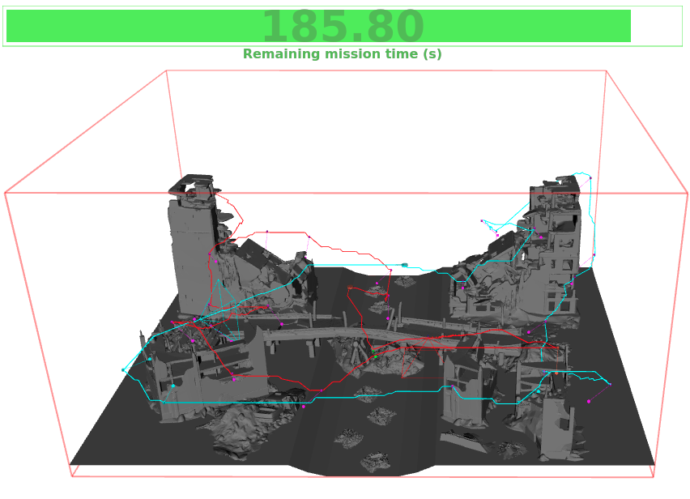
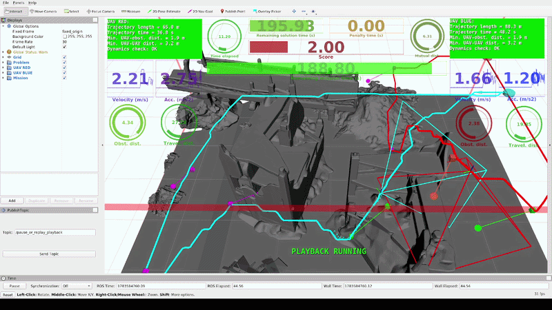

# MRS Summer School 2026: Multi-Robot Disaster Monitoring and Search in a Post-Disaster Environment

In this Summer School task, we will focus on the cooperation of a group of two UAVs (Unmanned Aerial Vehicles) in a 3D environment with obstacles.
The task is to plan collision-free trajectories of the UAVs so that cameras onboard the UAVs locate and observe a set of *N* unique inspection points representing possible human survivors, victims, or critical objects in a disaster-affected environment.
Both UAVs have a predefined starting position and a limit on maximal velocity and acceleration.
The objective of the task is to minimize the total mission time required to search and assess all points of interest while ensuring that all inspection points are visited, and that no collisions occur between the UAVs and the environment or between the UAVs themselves.
An already working solution is provided as a part of the assignment.
However, this example solution has poor performance and can be significantly improved.

---

## Our solution (team notes)

All changes live in `mrim_task/mrim_planner` (the only folder used during the competition evaluation). What we improved over the baseline:

1. **Heading interpolation** (`trajectory.py`): heading is interpolated linearly w.r.t. the distance traveled along each subtrajectory (baseline kept it constant → no points were scored).
2. **TSP over flight-time estimates** (`tsp_solvers.py`, `utils.py`): the TSP cost matrix uses per-axis trapezoidal flight-time estimates (incl. heading rotation time) instead of Euclidean distances; straight-line connections blocked by obstacles are penalized by a detour factor (`tsp/distance_estimates: euclidean_time`).
3. **Viewpoint assignment**: k-means clustering of the shared (purple) viewpoints with cluster-to-UAV mapping by start distance, followed by a **makespan balancing** step that moves shared viewpoints between the UAVs while a fast NN+2-opt tour estimator predicts an improvement (`tsp/balance_viewpoints`).
4. **Fast A\* planner** (`astar.py`): rewritten with `heapq` + numpy occupancy grid, Euclidean heuristic (weight 1.1), endpoint snapping to the nearest free cell, exact metric endpoints, recursive `halveAndTest` straightening + greedy shortcut pass. RRT/RRT* (`rrt.py`) finished as well (optimal-cost parent, rewiring, Gaussian sampling, goal bias, straightening) and used as an automatic **fallback** if A* fails on a leg.
5. **Smooth, continuous trajectories** (`trajectory.py`): pure-pursuit path smoothing that is guaranteed to pass exactly through every viewpoint, heading held constant within ±0.6 m of each viewpoint (robust inspection), TOPPRA time parametrization sampled at the trajectory dt — no stops at waypoints (`trajectory_sampling/with_stops: false`).
6. **UAV↔UAV collision avoidance** (`trajectory.py`): `delay_till_no_collisions_occur` — vectorized search for the minimal start delay of either UAV (with parked-UAV padding), choosing the option that minimizes the total mission time. Additionally, each UAV plans with a **keepout sphere** around the other UAV's start position (it may be parked there).
7. **Safety margins**: dynamic constraints scaled by `trajectories/dynamics_safety_factor` (0.95 virtual / 0.90 real world), extra obstacle planning margin, mutual-distance margin — the strict evaluator checks always pass with reserve.
8. **Self-check**: after planning, the planner verifies its own trajectories against the evaluation criteria (per-axis dynamics, obstacle/mutual distances, final positions, mission time, inspection coverage) and prints an OK/FAIL report.

9. **Robustness fallbacks**: LKH solver failure falls back to a built-in NN+2-opt solver; TOPPRA parametrization failure falls back to stop-at-waypoints sampling — no single component failure can zero the score.
10. **Unseen-world validation**: `local_eval/generate_problem.py` generates synthetic worlds similar to (and harder than) `apocalypse_large` — the competition evaluates on an unseen world, so the solution is validated on 6 generated worlds (`unseen_*` in `mrim_resources/problems`) besides the 3 official ones.

Local results (identical evaluation logic as `mrim_manager`, all constraint checks green):

| Problem              | Score  | Mission time | Planning time |
|----------------------|:------:|:------------:|:-------------:|
| apocalypse_small     | 8/8    | 26.6 s       | ~5 s          |
| apocalypse_moderate  | 16/16  | 45.4 s       | ~7 s          |
| apocalypse_large     | 29/29  | 72.8 s       | ~12 s         |
| unseen_comp_a/b/c    | 34+33+35 (all) | 82.8–84.8 s | ~15 s  |
| unseen_dense         | 34/34  | 91.2 s       | ~16 s         |
| unseen_tight         | 32/32  | 90.0 s       | ~14 s         |
| unseen_wide40        | 40/40  | 99.0 s       | ~17 s         |

### Quick testing on any machine (no ROS/Apptainer needed)

A lightweight harness in `local_eval/` runs the real planner code with ROS stubbed out and evaluates the result exactly like `mrim_manager` (score, dynamics, obstacle/mutual distances, final positions):

```bash
git clone https://github.com/thanhnguyencanh/summer-school-2026.git
cd summer-school-2026
./local_eval/setup.sh    # creates local_eval/venv + builds the LKH solver (needs python3-venv, gcc, wget)

# run + evaluate one problem:
./local_eval/venv/bin/python local_eval/harness/run_planner.py --problem apocalypse_small.problem
./local_eval/venv/bin/python local_eval/harness/run_planner.py --problem apocalypse_large.problem
# real-world config pipeline:
./local_eval/venv/bin/python local_eval/harness/run_planner.py --problem apocalypse_large.problem --config real_world
# quick parameter experiments without editing configs:
./local_eval/venv/bin/python local_eval/harness/run_planner.py --problem apocalypse_large.problem --set path_planner/astar/grid_resolution=0.5
```

The run ends with an `EVALUATION (mrim_manager mirror)` block — everything must be `OK` and `INSPECTED` must equal the number of points. For the full simulation test, use the official flow below (`./install.sh` once, then `./simulation/run_offline.sh`).

### Creating the competition submission

```bash
cd mrim_task && zip -r team_name.zip mrim_planner
```

---

## Installation

The Summer School 2026 will use the [MRS UAV System](https://github.com/ctu-mrs/mrs_uav_system) contained in a [Apptainer](https://apptainer.org/) image (previously called Singularity).
A set of scripts is provided to create a layer of abstraction above the Apptainer system, so the participants only need to know how to call a shell script, e.g.,

The following steps will download the main repository, install Apptainer (only on Ubuntu-compatible OS), and download the pre-built Apptainer image.
No further changes are made to the host operating system.

Compatible platforms:

* Linux OS,
* Windows 11 + WSL 2.0 with Linux OS,
* Windows with virtualized Linux OS,
* Mac OS X with virtualized Linux OS.

For a non-Ubuntu Linux OS, please, install Apptainer on your own.

Requirements:

* [Apptainer](https://apptainer.org/) on Linux OS,
* approx. 6 GB of disk space.

### Installation procedure

1. Clone our team repository to, e.g., `~/git`:
```bash
mkdir -p ${HOME}/git
cd ${HOME}/git && git clone https://github.com/thanhnguyencanh/summer-school-2026.git
```

2. Run the installation script that will install dependencies, download the MRS Apptainer image containing [MRS UAV System](https://github.com/ctu-mrs/mrs_uav_system), and compile the workspace:
```bash
cd ${HOME}/git/summer-school-2026 && ./install.sh
```

(The upstream task repository is `https://github.com/ctu-mrs/summer-school-2026.git` — it is configured as the `upstream` remote, so organizer fixes can be pulled with `git pull upstream master`.)

## Task overview

You are given two UAVs (Red 🟥 and Blue 🟦) required to inspect a set of **inspection points (IPs)** as fast as possible in a 3D environment with obstacles.
The two UAVs are equipped with the [MRS control pipeline](https://github.com/ctu-mrs/uav_core) [1], allowing precise trajectory tracking.
Your task is to assign the IPs to the UAVs and to generate multi-goal paths visiting **viewpoints (VPs)** (poses in which the particular IPs are inspected with onboard cameras) of each IP while keeping a safe distance from the obstacles and between the two UAVs.
Furthermore, you shall convert paths to collision-free time-parametrized trajectories that respect the UAVs' dynamic [constraints](#constraints).
The IPs are defined by their position and inspection angle and are divided into three subsets:

1. 🔴 red locations: inspectable by 🟥 UAV only,
2. 🔵 blue locations: inspectable by 🟦 UAV only,
3. 🟣 purple locations: inspectable by both (🟥 or 🟦)  UAVs.



To inspect an IP, you have to visit its attached VP with a correct UAV within a radius of 0.3 m and with a maximum deviation in inspection heading and pitch of 0.2 rad.
**Each successfully inspected point increments your score by 1.**
The overall objective is to maximize the score while minimizing the flight time of both UAVs.

The trajectories are required to begin and end at predefined starting locations.
The mission starts when the trajectory following is started and ends once the UAVs stop at their starting locations.
The motion blur effect during imaging is neglected; thus, the UAVs are not required to stop at particular VPs.

## Task assignment

There is a low-performance solution available at your hands.
This solution consists of:

* non-controlled heading of the UAVs,
* random assignment of common IPs 🟣 to each UAV,
* computation of TSP (Traveling Salesman Problem) tours using Euclidean distance estimates,
* planning paths with the use of badly parametrized RRT planner,
* generation of trajectories with required zero velocity at the end of each straight segment,
* mutual UAV to UAV collision avoidance is disabled.

The solution produced by this approach has very poor performance and does not score any points, yet provides large space for improvement.
To improve the solution, you can follow the steps suggested below or find your way to improve the solution.
Please go through the code and its inline comments to give you a better idea about individual tips.

  **Tips for improving the solution:**

  1. Interpolate the heading between the samples. This is the first thing to solve if you want to be efficient!
  2. Test different methods available for estimating the distance between the VPs and for planning collision-free paths connecting the VPs [available planners: A*, RRT (default), RRT*].
  3. Improve assignment of inspected points from 🟣 between the two UAVs (random by default).
  4. Try different parameters of path planners (e.g., grid resolution or sampling distance) and evaluate their impact on the quality of your solution.
  5. Increase performance of the chosen path planner (e.g., by path straightening or implementing informed RRT).
  6. Consider flight time instead of path length when searching for the optimal sequence of locations in TSP.
  7. Apply path smoothing and continuous trajectory sampling (no stops at waypoints) to speed up the flight. In the code, we have prepared the `toppra` library for computing path parametrizations [2]. Check out the [documentation](https://hungpham2511.github.io/toppra/) and try to utilize it.
  8. Postprocess the time-parametrized trajectories to resolve UAV to UAV collisions. Start by implementing collision avoidance, e.g., by delaying trajectory start till there is no collision. Tip: try the methods available for you in the config file (see below).
  9. Effectively redistribute IPs to avoid collisions and to achieve lower inspection time.

  **Things to avoid:**

* Very high minimum distance from obstacles could lead to path planners failing to find a path to some locations.
* Smoothing and shortening the path in locations of inspections could lead to missing the inspection point.
* Sampling on a grid with a small resolution could lead to errors emerging from discretization.

Note that the overall task is very complex to be fully solved in a limited time during the summer school.
You are not expected to solve every subproblem so do not feel bad if you don't.
Instead, try to exploit and improve the parts of the solution you are most interested in or think to improve the solution the most.
While designing your solution, do not forget to consider maximum computational time.
We limit your computational time to speed up the flow of the competition.
Although we prepared a skeleton solution as a baseline, **feel free to design your algorithms to improve the overall performance**.
Good luck!

### Constraints

Your solution to both the challenges has to conform to constraints summarized in the following table:

| Constraint                                          | Virtual challenge | Real-world challenge |
| :---                                                | :---:             | :---:                |
| Maximum solution time (soft) - $T_s$                | 120 s             | 80 s                 |
| Maximum solution time (hard)                        | 200 s             | 150 s                 |
| Maximum mission time                                | 200 s             | 240 s                |
| Maximum velocity per x and y axes                   | 5 m/s             | 3 m/s                |
| Maximum velocity in z axis                          | 2 m/s             | 1 m/s                |
| Maximum acceleration per x and y axes               | 5 m/s^2           | 3 m/s^2              |
| Maximum acceleration in z axis                      | 2 m/s^2           | 1 m/s^2              |
| Maximum heading rate                                | 1 rad/s           | 1 rad/s              |
| Maximum heading acceleration                        | 2 rad/s^2         | 2 rad/s^2            |
| Minimum obstacle distance                           | 1.5 m             | 2.0 m                |
| Minimum mutual distance                             | 2.5 m             | 4.0 m                |
| Dist. from starting position to stop the mission:\* | 1.0 m             | 1.0 m                |

\* The last point of the trajectory is expected to match the starting point with up to 1 m tolerance.

## Where to code changes
Change your code within directory `summer-school-2026/mrim_task/mrim_planner` (changes in other folders (`mrim_manager,mrim_resources, mrim_state_machine`) will not be applied during competition/evaluation) in files:

* `scripts/`
  * `planner.py`: Crossroad script where the path to your solution begins. Here you will find initial ideas and examples on how to load parameters.
  * `trajectory.py`: Contains functionalities for basic work with trajectories. Here, you can **interpolate heading** between the path waypoints and experiment with smoothing the paths, sampling the trajectories, computing collisions between points/paths/trajectories, or postprocessing trajectories to prevent collisions.
  * `solvers/`
    * `tsp_solvers.py`: This is where VPs assignment for TSP, path planning, and solving TSP happens. Here you can play with an efficient assignment of VPs to UAVs or study the effect of path planners on TSP solution performance.
    * `utils.py`: Default source of various utility functions. Feel free to add your own.
  * `path_planners/grid_based`
    * `astar.py`: Implementation of A* path planner. Here you can finish the planner using proper heuristic function, and add path straightening functionality.
  * `path_planners/sampling_based`
    * `rrt.py`: Implementation of RRT path planner. Here you can upgrade the planner to RRT*, implement a better sampling method, and add path straightening functionality.
  * `config/`
    * `virtual.yaml` and `real_world.yaml`: Config files (for two challenges described below) containing various parameters/switches for the task. If you need other parameters, add them here, load them in `scripts/planner.py` and use them in the code accordingly.

In the files, look for keywords **`STUDENTS TODO`**, located in areas where you probably want to write/use some code.
By default, you should not be required to make changes to other than the above-specified files.

**Where else to look:**

Throughout the code, we use some custom classes as data types.
Check `mrim_planner/scripts/data_types.py` to see what the classes do.

Apart from the configs in `mrim_planner/config`, default configs for the mission are loaded from `mrim_manager/config` for each run type.
Take a look here to see the trajectories' dynamic constraints or safety limits.
`mrim_manager/config` **should not be changed!**

## Run your code

A set of scripts is provided in `simulation/`, allowing you to start and stop the simulation and evaluate your code.
The **bold** scripts are expected to be used directly by the user.

| Script                 | Description                                                                       |
| :---                   | :---:                                                                             |
| **pycharm.sh**         | runs PyCharm inside Apptainer                                                     |
| **run_offline.sh**     | runs your solution using a lightweight _replay_                                   |
| **run_simulation.sh**  | runs your solution inside a realtime dynamics simulation                          |
| **kill_simulation.sh** | kills the running simulation environment                                          |
| 01_install.sh          | install the Apptainer software (called within `install.sh`)                       |
| 02_download.sh         | downloads the Apptainer image (called within `install.sh`)                        |
| 03_compile.sh          | compiles the user's software (called within `install.sh`)                         |
| apptainer.sh           | entry point to the Apptainer's shell (only run if you intend to program in `vim`) |

**1) Offline: lightweight without simulating UAV flight**

We recommend starting _offline_ (without using the dynamics simulator) when approaching the task for the first time.
The script below will run a solution to the task while showing the problem and the trajectories.
```bash
./simulation/run_offline.sh
```

After running the `run_offline.sh` script, you should see a similar visualization once the trajectory generation process is completed.
The RViz (ROS visualization) shows an **example solution** to the task.



The RViz window contains:

* Start/pause button in the left bottom corner. **(Use 'Send Topic' button and not the Rviz 'Pause' button)**
* overall trajectories information in the top left/right corners (background is green if every check is OK, red otherwise)
* current flight statistics right below
* information about the mission and the score centered in the top
* lines intersecting both paths which indicate collisions.

**2) Online: run simulation locally**

The script below will execute your solution to the task alongside the *MRS Multirotor Simulator* and the [MRS UAV system](https://github.com/ctu-mrs/mrs_uav_system) [1] simulating two UAVs.
```bash
./simulation/run_simulation.sh
```
Stopping the simulation is done by calling
```bash
./simulation/kill_simulation.sh
```
**Things to configure/change :**

* **Problem Type:** By default, the `run_simulation.sh` spawns you 2 UAVs in the `apocalypse_small` world and launches the *apocalypse_small* problem.
To change the problem type to `apocalypse_moderate` or `apocalypse_large`, you have to

  * change the parameter `problem/name` in the `mrim_task/mrim_planner/config/virtual.yaml` to `apocalypse_moderate.problem` or `apocalypse_large.problem` (see section [Testing](https://github.com/ctu-mrs/summer-school-2026?tab=readme-ov-file#problem-sets---testing))

You may notice that your terminal opened multiple tabs.
Check the first page of the [MRS Cheatsheet](https://github.com/ctu-mrs/mrs_cheatsheet) if you need help navigating the tabs and panes.

The terminal window will contain the interface of the Tmux: the terminal multiplexer.
It allows us to execute multiple commands in multiple terminals in one terminal window.
The Tmux window will contain "tabs" (panes), which are listed at the bottom of the window.
Switching between the tabs is done by the key combinations **shift→** and **shift←**.
The important tabs are listed below:

| Tab            | Description                                                                    |
| :---           | :---:                                                                          |
| planner        | the output of your planner                                                     |
| state_machine  | this node queries the planners for trajectories and handles the experiment     |
| start_planning | here, a command is prepared in the shell's history to start the planning again |
| control        | The MRS UAV System control pipeline                                            |

Please, **check the outputs of the programs for errors first before emailing and asking the MRS crew for help**.
Most often, the reason for your problem will be explained in some error message in one of the windows.

**3) Online: prepare for real-world experiments**

The preparation for a real-world experiment does not require any actions on your side.
You are required only to provide functional code for trajectory planning contained in the `mrim_planner`.
If you created other ROS nodes, which shall be run separately to the `mrim_planner`, include their launching in `mrim_planner/launch/planner.launch`.

## Problem sets - Testing

You have three problems prepared for testing and evaluating your solution.
The problems are located in `mrim_resources/problems`: you can switch between them by changing the `problem/name` line in `mrim_planner/config/virtual.yaml` to:

  1. `apocalypse_small.problem` is a simple problem with fewer IPs, good for clustering, improving TSP sequences, parametrizing the solution, and testing
  2. `apocalypse_moderate.problem` is a complex problem with 16 IPs that will test your solution in full
  3. `apocalypse_large.problem` is a complex problem with 30 IPs that will test your solution in full, good for final tuning of parameters (**a similar problem will be used in the competitions** described below)

## Competition

There will be two competitions:

  1. In the virtual environment, and
  2. in the real world.

To participate in the competitions, you have to fill out this [google form](https://docs.google.com/forms/d/1jcoQr2TPbzro8bFdiUZ3yzLbKQDW0foHmKn6kjHJXjQ) until Monday, August 3th, 11:59 p.m.
In the google form you are required to submit your team name, team members and your solution in a zip archive.
The submitted archive has to contain the whole package `mrim_planner`, including two config files (`real_world.yaml` and `virtual.yaml`) in the folder `mrim_planner/config`. 
**Please don't forget to modify the parameters in `real_world.yaml` according to your findings/configuration in virtual worlds.**
To create the zip archive, run e.g.:
```bash
zip -r team_name.zip mrim_planner
```
**The late submissions will not be accepted for the competition**.

The evaluation of particular solutions in the real-world challenge will be performed on Tuesday, August 4th, with the real-time score presentation.
The virtual challenge will be evaluated on Tuesday.
The results will be presented during an awards ceremony organized at the experimental site after the real-world challenge.
**The final score of the solution equals the sum of successfully inspected IPs.**

**Reasons to assign zero score (and thus to disqualify the solution):**

  1. violation of assigned dynamic constraints of UAVs (**in horizontal and vertical directions only**; violation of constraints on heading does not affect the score but beware that the heading rate/acceleration of the UAV controller will be limited by these constraints),
  2. violation of minimum allowed distance between obstacles and UAVs,
  3. violation of minimum allowed mutual distance between UAVs,
  4. violation of maximum distance of final trajectory point to the predefined starting location,
  5. exceeding the hard maximum available time for computing a solution (see the [constraints](#constraints) table).

In case of a tie, **secondary key** to determine the finishing order of the participating teams is given as $T_I + T_P$ (in seconds), where $T_I$ is the inspection time (start to end of both trajectories) and $T_P = max(0, T_C - T_s)$ is the time $T_C$ it took to compute the solution minus the soft limit $T_s$ for computing the solution (see the [constraints](#constraints) table).

### Virtual

The dimensions of the virtual environment and inspection problem will be slightly larger than `apocalypse_large.problem`.
Please expect that, the solution will be tested on a ThinkPad T480s, with an Intel Core i7-8550U CPU @ 1.80GHz. 
Your solution for the virtual environment has to conform to constraints summarized in the table above.

### Real-world

The dimensions of the real-world environment and inspection problem will be similar to `apocalypse_large.problem` but with significantly less obstacles.
The same code as the virtual challenge will be run onboard real UAVs during the real-world challenge.
No changes are required on your side.
However, note that the evaluation of inspected points will be based on the actual pose of the UAV in the world, not the reference trajectories.
Hence, the effect of trajectory tracking will not be negligible, and you should consider the challenges of the real-world environment.
Consider the challenges during parametrization and prepare your solution for deviations from the ideal conditions. E.g., introduce reserves for UAV-to-UAV and UAV-to-obstacles distances to prevent unfortunate zeroing of your score or lower the magnitude of allowed deviations from the reference trajectory.

## Explore another possible usage of the MRS UAV System

Based on the presentation of the MRS system, you can also try other capabilities of the system.
You selected a group of practicals based on your scientific interest.
Feel free to ask during the summer school and especially during the seminars how the system can be used for your area of interest.

## Troubleshooting

**Common error you might observe**
```
open terminal failed: missing or unsuitable terminal: rxvt-unicode-256color
```

*solution*: run the `./kill_simulation.sh` script.

**Updating the repository**

If there is an update in the repository, you can pull it to your local machine using git:
```
cd ${HOME}/git/summer-school-2026 && git pull
```

**Google**

Before asking for help, try to come up with the answer on your own or with the assistance of a Google search or ChatGPT.
Sometimes just writing the question down helps you to understand the problem.

**Contacts**

If you find a bug in the task, you need assistance, or you have any other questions, please contact by email one of (or all of):

* Václav Riss `rissvacl@fel.cvut.cz`
* Jindřich Třaskoš `traskjin@fel.cvut.cz`
* Martin Zoula `zoulamar@fel.cvut.cz`

We will try to help you as soon as possible.

## Disclaimer

During the week of the 2026 MRS Summer School, the organizers reserve the right to:

* to do fixes: to update the task in case of finding severe bugs in the code,
* to maintain fairness: to change the problems or the constraints for the challenges,
* to preserve safety: to discard provided trajectories for the real-world challenge if the flight would be unsafe in any possible way.

## References

* [1]  Baca, T., Petrlik, M., Vrba, M., Spurny, V., Penicka, R., Hert, D., and Saska, M., [The MRS UAV System: Pushing the Frontiers of Reproducible Research, Real-world Deployment, and Education with Autonomous Unmanned Aerial Vehicles](https://arxiv.org/pdf/2008.08050), _Journal of Intelligent & Robotic Systems 102(26):1–28, May 2021_, GitHub: https://github.com/ctu-mrs/mrs_uav_system.
* [2]  H. Pham, Q. C. Pham, [A New Approach to Time-Optimal Path Parameterization Based on Reachability Analysis](https://www.researchgate.net/publication/318671280_A_New_Approach_to_Time-Optimal_Path_Parameterization_Based_on_Reachability_Analysis), [Documentation](https://hungpham2511.github.io/toppra/index.html)
